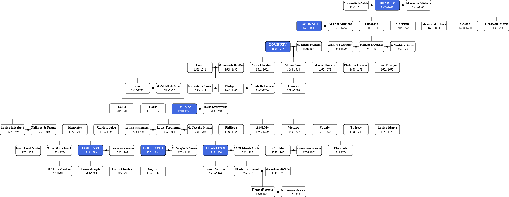

# Lignage

Lignage is a JavaScript tool aimed at generating family trees, with an ancestor as a root.
All descendents of this ancestor, as well as all their spouses, will be displayed.



## Limitations

- The tree must be an acyclic graph (i.e. no consanguinity)
- The tree must be rooted (i.e. no ancestry for non-descendents)
- Descendents can have at most two spouses

## Usage

```html
<script src="lignage.js"/>

<svg id="lignage"></svg>

<script>
    const nodes = [
        {id: "johnDoe", "name": "John Doe"},
        {id: "janeDoe", "name": "Jane Doe", spouse: "johnDoe"},
        {id: "babyDoe", "name": "Baby Doe", parent: "janeDoe"}
    ];
    const options = {};
    Lignage(document.getElementById("lignage"), nodes, options);
</script>
```

## Data

Each node can have the following properties:

- **id** (mandatory): identifier
- **name**: string that will be displayed
- **spouse**: identifier of the spouse (only for non-descendents)
- **parent**: identifier of the parent (if parent is a descendent, the node will be added outside of marriage)
- **text**: additional string (typically used for birth/death dates)
- **class**: DOM class used for styling
- **url**: link to an external resource
- **image**: link to an external image

Note that the order of nodes matters, as children need to be defined after their parent,
and non-descendent spouses after their spouse.

## Options

The following options can be used:

- **root**: identifier of the root node
- **exclude**: list of identifiers for nodes to be excluded from the tree
- **width**: width of the box representing nodes (default: 120)
- **height**: height of the box representing nodes (default depends on the value of the image flag)
- **parentMargin**: vertical spacing between parent and children (default: 80)
- **spouseMargin**: horizontal spacing between spouses (default: 30)
- **siblingMargin**: minimal horizontal spacing between siblings (default: 30)
- **cousinMargin**: minimal horizontal spacing between cousins (default: 100)
- **image**: whether or not to display images (default: false)
- **editable**: whether or not to allow on-the-fly edition (default: false)
- **fontSize**: size of the font used (default: 16)

## Styling

Styling can be performed by appending a <style> tag to the SVG element, and by using the corresponding classes with the `class` node property.

For instance:

```html
<svg id="lignage">
    <style>
        .royal rect {
            fill: royalblue;
        }
        .royal text {
            fill: white;
        }
    </style>
</svg>
```
