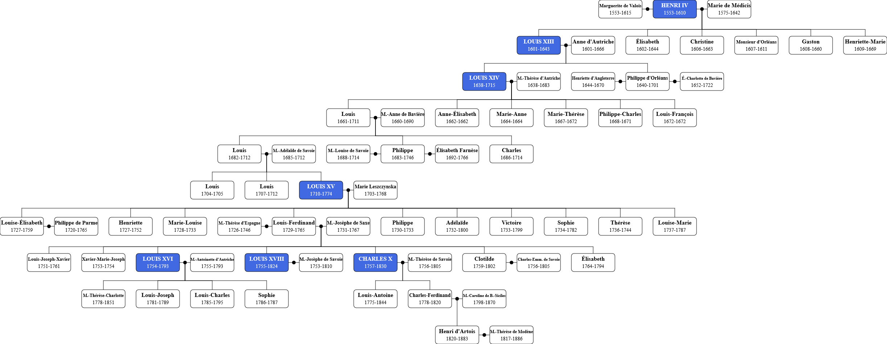

# Lignage

Lignage is a JavaScript tool aimed at generating family trees.
It is designed as a top-down approach, starting with an ancestor as a root,
and displaying descendents of this ancestor, as well as their spouses.



## Gallery

Historical:

[](https://blipz.github.io/Lignage/examples/lagids.html)
[](https://blipz.github.io/Lignage/examples/constantinians.html)
[](https://blipz.github.io/Lignage/examples/plantagenet.html)
[](https://blipz.github.io/Lignage/examples/ottomans.html)
[](https://blipz.github.io/Lignage/examples/bourbon.html)
[](https://blipz.github.io/Lignage/examples/yamato.html)
[](https://blipz.github.io/Lignage/examples/romanov.html)
[](https://blipz.github.io/Lignage/examples/habsburgLorraine.html)

Fantasy:

[](https://blipz.github.io/Lignage/examples/stark.html)

## Limitations

- The tree must be an acyclic graph (i.e. no consanguinity)
- The tree must be rooted (i.e. no ancestry for non-descendents)
- Descendents can have at most two spouses

See below for means to mitigate some of these limitations.

## Usage

```html
<script src="lignage.js"/>

<svg id="lignage"></svg>

<script>
    const nodes = [
        {id: "johnDoe", name: "John Doe"},
        {id: "janeDoe", name: "Jane Doe", spouse: "johnDoe"},
        {id: "babyDoe", name: "Baby Doe", parent: "janeDoe"}
    ];
    const options = {};
    Lignage(document.getElementById("lignage"), nodes, options);
</script>
```

## Data

Each node can have the following properties:

- **id** (mandatory): identifier
- **name**: string that will be displayed
- **spouse**: identifier of the spouse (only for non-descendents)
- **parent**: identifier of the parent (if parent is a descendent, the node will be added outside of marriage)
- **text**: additional string (typically used for birth/death dates)
- **class**: DOM class used for styling
- **url**: link to an external resource
- **image**: link to an external image
- **align**: how a descendent node is aligned in regard to its children, can be "left", "center" or "right" (default: the `align` option)
- **skips**: number of levels (i.e. generations) to skip for a descendent node (default: 0)
- **before**: whether or not to place a non-descendent node before their spouse (default: false)
- **virtual**: whether or not to consider this node as virtual, hiding it with all of its links (default: false)

Note that the order of nodes matters, as children need to be defined after their parent,
and non-descendent spouses after their spouse.

## Options

The following options can be used:

- **root**: identifier of the root node
- **exclude**: list of identifiers for nodes to be excluded from the tree
- **links**: list of additional links to be drawn, each link being an object with the following attributes:
  - **start** (mandatory): identifier of the start node, or array of identifiers of two spouse nodes
  - **end** (mandatory): identifier of the end node
  - **type**: one of the following values (default: union)
    - descent: for representing a parental link (start bottom -> end top)
    - union: for representing a marriage link (start bottom -> end bottom)
    - closeUnion: for representing a marriage link between adjacent nodes (start right -> end left)
  - **startDx**: horizontal shift at the start of the link (default: 0)
  - **endDx**: horizontal shift at the end of the link (default: 0)
  - **x**: horizontal value to help drawing the link (default: 0.5)
  - **y**: vertical value to help drawing the link (default: 0.5)
  - **replace**: whether or not to omit the automated link joining the end node to the tree (default: false)
  - **class**: DOM class used for styling
- **width**: width of the box representing nodes (default: 120)
- **height**: height of the box representing nodes (default depends on the value of the `images` flag)
- **parentMargin**: vertical spacing between parent and children (default: 80)
- **spouseMargin**: horizontal spacing between spouses (default: 30)
- **siblingMargin**: minimal horizontal spacing between siblings (default: 30)
- **cousinMargin**: minimal horizontal spacing between cousins (default: 100)
- **images**: whether or not to display images (default: false)
- **editable**: whether or not to allow on-the-fly edition (default: false)
- **fontFamily**: family of the font used for the node name (default: the browser default font)
- **fontSize**: size of the font used for the node name (default: 16)
- **fontVariant**: variant of the font used for the node name (default: "normal")
- **fontWeight**: weight of the font used for the node name (default: "bold")
- **align**: default value for the `align` node property, can be "left", "center" or "right" (default: "center")
- **orient**: orientation of the tree, can be "top", "bottom", "left" or "right" (default: "top")
- **fonts**: list of external fonts to load, each font being an object with the following attributes:
  - **family**: family of the font
  - **url**: link to an external font file
- **title**: object representing a title associated to the tree, with the following attributes:
  - **text** (mandatory): text to write
  - **fontFamily**: family of the font used (default: the browser default font)
  - **fontSize**: size of the font used (default: the browser default size)
  - **fontVariant**: variant of the font used (default: "normal")
  - **fontWeight**: weight of the font used (default: "normal")
  - **x**: horizontal position of the title (default: 0)
  - **y**: vertical position of the title (default: 0)
- **emblem**: object representing an emblem associated to the tree, with the following attributes:
  - **url** (mandatory): link to an external image
  - **scale**: scaling factor for the image (default: 1)
  - **x**: horizontal position of the image (default: 0)
  - **y**: vertical position of the image (default: 0)

## API

The following section details the API provided by the Lignage object in order to interact with the tree.
See the [Stark family](examples/stark.html) for a concrete use case.

### Tree manipulation

- **add(nodeData)**: adds a new node to the tree (nodeData is the same object described above)
- **get(nodeId)**: gets the node identified by the ID
- **remove(nodeId)**: removes the node (and all its descendents) from the tree, as well as its spouse(s) if it is a descendent node

### Option tuning

- **getOption(name)**: returns the value of the option
- **setOption(name, value)**: sets the option to the value provided.

Note that `setOption` has no effect on the `exclude` option. Call `remove` instead.

### Export

- **downloadPNG(filename)**: downloads the tree in PNG format
- **downloadSVG(filename)**: downloads the tree in SVG format
- **exportJSON()**: copies the JSON node data to the clipboard

Note that the generated PNG or SVG might not contain images defined by the node `image` property, due to the same origin policy.
Therefore, a web server hosting the page and the images should be set up if this is needed.

## Styling

Styling can be performed by appending a `<style>` tag to the SVG element, and by using the corresponding classes with the `class` node/link property.

For instance:

```html
<svg id="lignage">
    <style>
        .royal rect {
            fill: royalblue;
        }
        .royal text {
            fill: white;
        }
    </style>
</svg>
```

## Handling consanguine unions

The following section details some workarounds to handle consanguine unions.
See the [Lagid dynasty](examples/lagids.html) for a concrete use case.

### General case

In the general case, you can assign all the children to one of the spouses, without defining a spouse relationship between them.
Then, manually add a link between the spouses using the `links` option.

Example:

```javascript
const links = [
    {start: "spouse1", end: "spouse2"}
];
```

### Between siblings or cousins

If the spouses are same-level nodes, an alternative way consists of omitting the parent relationship for one of the spouses.
Then, manually add a link between the parentless spouse and the parents, using the `links` option.

Note that this may result in links crossing each other (in the cousin case), or sibling order not being respected (in the case where spouses are non-adjacent siblings).

Example:

```javascript
const links = [
    {start: ["parent1", "parent2"], end: "child", type: "descent"}
];
```

## Handling more than one root node

In order to simulate multiple root nodes, and thus add ancestors for some non-descendent nodes, a virtual root node linked to these nodes can be defined.
This means that consanguine unions will appear as soon as any two of these subtrees join (see the section above).

Example:
```javascript
const nodes = [
    {id: "realRoot", virtual: true},
    {id: "fakeRoot1", parent: "realRoot"},
    {id: "fakeRoot2", parent: "realRoot"},
    {id: "fakeRoot3", parent: "realRoot"}
];
```

See the [Stark family](examples/stark.html) for a concrete use case.
